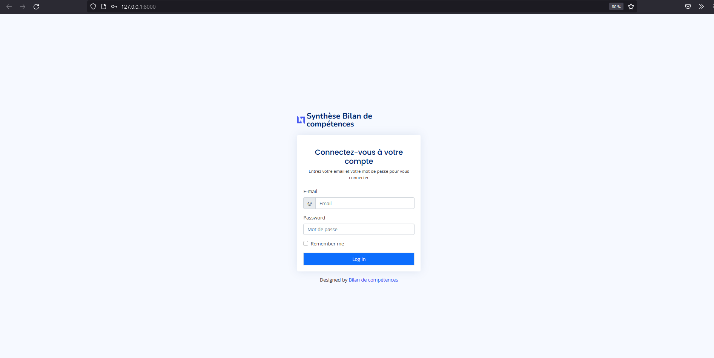
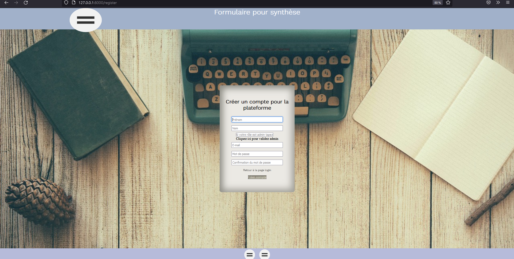
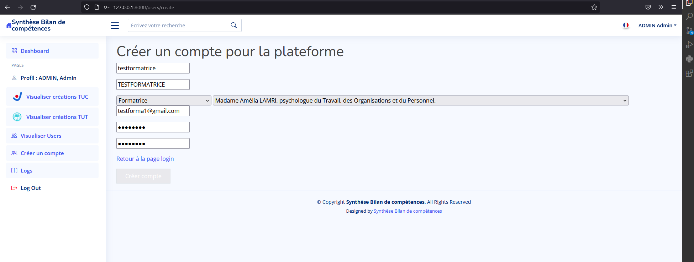
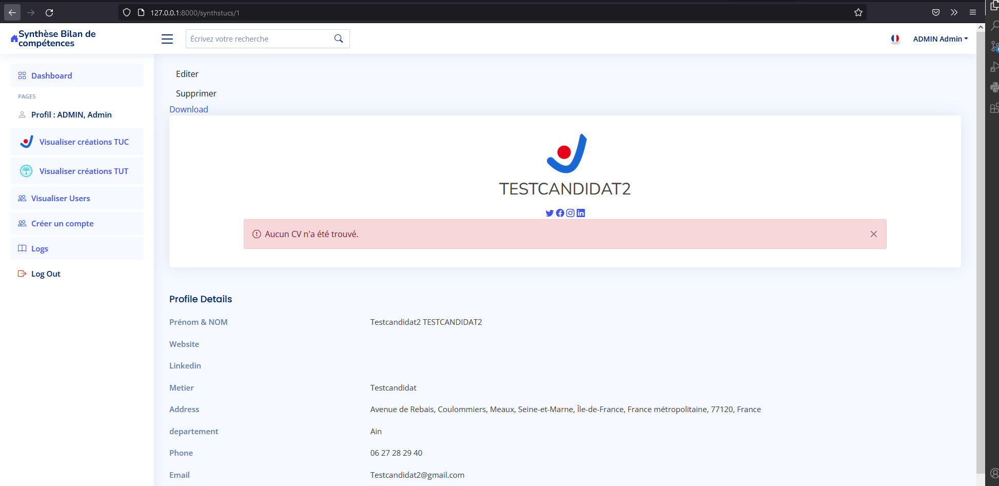
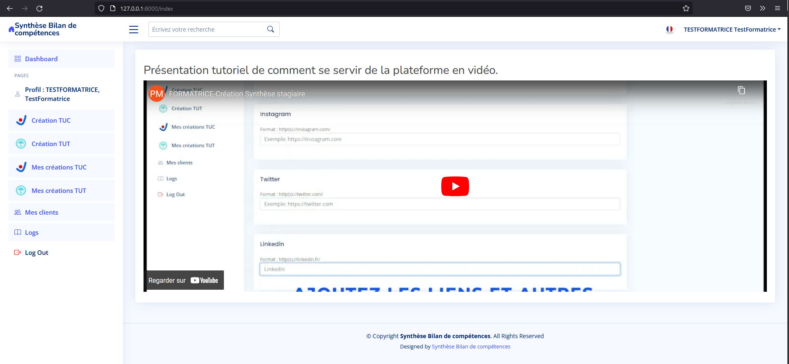
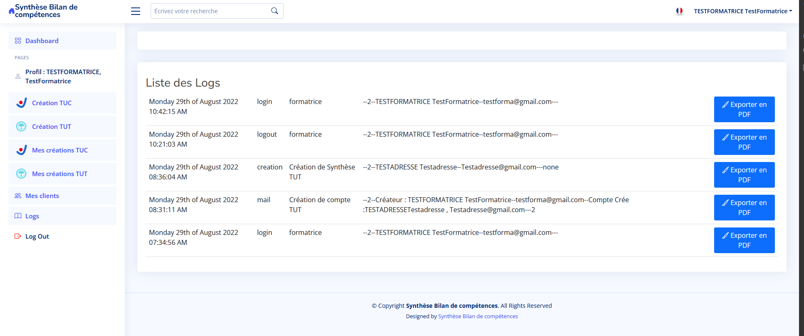

# Bdc synthese - Version Offline

#### Sommaires

<pre>
1 - Description
2 - Logiciels et versions utilisées
3 - Pour lancer le projet
4 - Tester le projet
   a - Register/Login admin
   b - Formatrice
5 - Remerciements
</pre>

#### 1 - Description

Version localhost du site bdc-synthese.fr/ avec wamp

#### 2 - Logiciels et versions utilisées

Wampserver 3.2.6
phpmyadmin 5.1.1
adminer 4.8.1
apache 2.4.51
php 7.4.26
mysql 8.0.27
mariadb 10.6.5

#### 3 - Pour lancer le projet

Après l'avoir installé le projet via github avec gitclone.

Rentrer dans le projet et commencer par installer l'environnement avec :
```cp .env.example .env```

Ensuite installer le dossier vendors et ses requirements :

```composer install```
```composer require cmgmyr/messenger```
```php artisan vendor:publish --tag=laravel-pagination```

Enfin générer la clé avec :  
```php artisan key:generate```

Il vous suffira de faire :
```php artisan serve```

Et vous pourrez lancer le projet afin de le tester.

#### 4 - Tester le projet

##### Partie A Register/login admin

Après avoir lancer php artisan serve, vous serez à la page du login de localhost http://127.0.0.1:8000/


Il faudra que vous vous connecter à la page register caché du site afin de vous connecter en tant qu'admin pour pouvoir créer des comptes et tester la plateforme.

Entrer donc dans l'url "/register" et vous arriverez sur cette page.


Tapez les coordonnées que vous voulez pour un compte admin en cliquant bien sur le texte après avoir rentré le mot de passe pour le rôle admin qui est "admin6288". Cliquez bien dessus autrement la création de compte ne se fera pas.

Après avoir crée un compte admin et vous êtes connecté vous pouvez créer un compte formatrice afin de tester la partie formatrice, en cliquant sur créer un compte sur la navbar.

Beaucoup de fonctionnalités sont comprises dans la navbar et il est d'ailleurs possible d'utiliser la barre de recherche pour faciliter la recherche d'un candidat/therapeute.



En visualisant la description synthese des créations TUC / TUT; vous pourrez accéder au bouton download json en tant qu'admin.



Pour la suite référé vous au script posteur T1C et T1T.

##### Partie B Formatrice

Connecter vous au compte formatrice que vous avez crée et vous pourrez accéder à la navbar qui est typique d'une formatrice. Vous avez de plus une vidéo explicative.



Il est possible de créer soit des TUC, soit des TUT, vous pouvez de plus accéder aux logs de vos activités sur votre compte.



Beaucoup de fonctionnalités sont comprises dans la navbar et il est d'ailleurs possible d'utiliser la barre de recherche pour faciliter la recherche d'un candidat/therapeute.

##### Partie C Client

Vous pouvez vous coonnecter en tant que client pour tester les fonctionnalités partie client.

##### Remerciements

Je remercie DASSI Manuel et Jonathan RANCHIN pour leur participations et contributions à ce projet.
